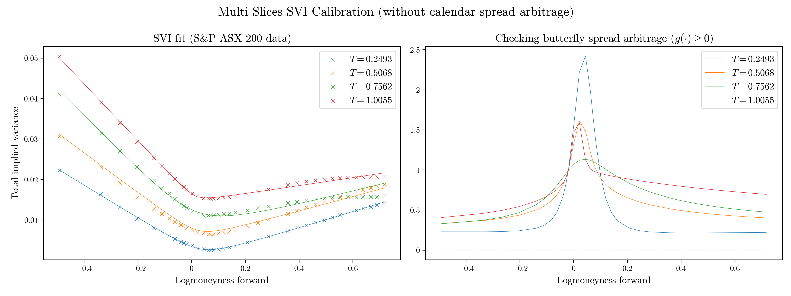
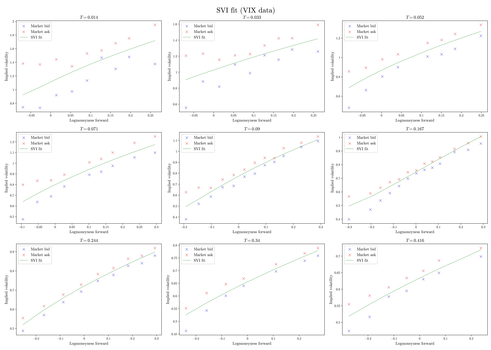

### SVI
In [1], Jim Gatheral proposes the following parametric form to model the fixed-maturity smile:

$$v(k, T) = a + b\left(\rho(k-m) + \sqrt{(x-m^2) + \sigma^2}\right),$$

where $v(k, T)$ is the implied variance at fixed time-to-maturity $T$, $x = \ln(K/F_T)$ the log-moneyness forward and $(a, b, m,\rho, \sigma)$ are the model parameters. Despite the simplicity of this model, its calibration remains intricate. Here we propose an implementation of the so-called Quasi-Explicit method proposed in [2] based on dimension reduction, which stabilizes and **significantly** improves calibration. 

We also aim to ensure that each individual slice is free of butterfly arbitrage.
A well-known sufficient condition for this is that its density $g$ be non-negative.
For further details, see [3].

A clear calendar-spread arbitrage is present here: the total implied variance trajectories
$w(k,T) := Tv(k,T)$ intersect across maturities. [3] also provides a procedure to prevent this behaviour, which leads to:

We additionally assessed how well this method performs when applied to VIX option smiles:

### (e)SSVI

### References:

[1] J. Gatheral. A parsimonious arbitrage-free implied volatility parameterization
with application to the valuation of volatility derivatives. *Global Derivatives & Risk.*

[2] S. De Marco. On probability distributions of diffusions and financial models with non-globally smooth coefficients. 

[3] J. Gatheral, A. Jacquier Arbitrage-free SVI volatility surfaces.
