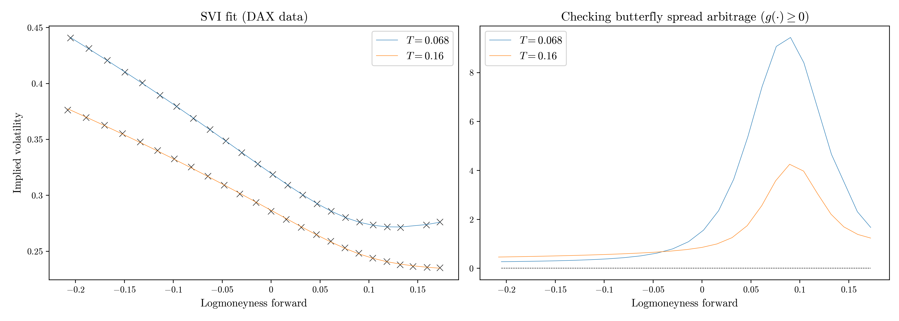

### SVI
In [1], Jim Gatheral proposes the following parametric form to model the fixed-maturity smile:

$$v(k, T) = a + b\left(\rho(k-m) + \sqrt{(k-m)^2 + \sigma^2}\right),$$

where $v(k, T)$ is the implied variance at fixed time-to-maturity $T$, $x = \ln(K/F_T)$ the log-moneyness forward and $(a, b, m,\rho, \sigma)$ are the model parameters. Despite the simplicity of this model, its calibration remains intricate. Here we propose an implementation of the so-called Quasi-Explicit method proposed in [2] based on dimension reduction, which stabilizes and **significantly** improves calibration.

We also aim to ensure that each individual slice is free of butterfly arbitrage.
A well-known sufficient condition for this is that its density $g$ be non-negative.
For further details, see [3].

A clear calendar-spread arbitrage is present here: the total implied variance trajectories
$w(k,T) := Tv(k,T)$ intersect across maturities. [3] also provides a procedure to prevent this behaviour, which leads to:

We additionally assessed how well this method performs when applied to VIX option smiles:

### (e)SSVI

It is important to note that SVI has no explicit time dependency and is therefore unable by construction to fit a full volatility surface across maturities.
Several extensions have been proposed; among them, we focus on the one introduced in [4],
which parametrizes each slice through the ATM total implied variance curve $\theta_t$ and allows the skew $\rho$ to depend on $\theta_t$. Considering a curvature curve $\varphi$, the total implied variance is expressed as follows:  

$$w(k,\theta_t) = \frac{\theta_t}{2}\left(1 + \rho(\theta_t)\varphi(\theta_t) k + \sqrt{(\varphi(\theta_t)k + \rho(\theta_t))^2 +1 -\rho(\theta_t)^2}\right).$$

We provide implementations of two techniques:
- `eSSVI` – Introduced in [5], based on anchoring each slice.
This approach performs well but requires strong market liquidity around the money to be accurate.
- `eSSVI_2` – Introduced in [6], relying on a global re-parametrization
that removes the dependency on liquidity conditions.

### References:

[1] J. Gatheral. A parsimonious arbitrage-free implied volatility parameterization
with application to the valuation of volatility derivatives. *Global Derivatives & Risk.*

[2] S. De Marco. On probability distributions of diffusions and financial models with non-globally smooth coefficients. 

[3] J. Gatheral, A. Jacquier Arbitrage-free SVI volatility surfaces.

[4] S. Hendriks, C. Martini. The extended SSVI volatility surface.

[5] J. Corbetta, P. Cohort, I. Laarchir, C. Martini. Robust calibration and arbitrage-free interpolation of SSVI slices.

[6] A. Mingone. No arbitrage global parametrization for the eSSVI volatility
surface.
